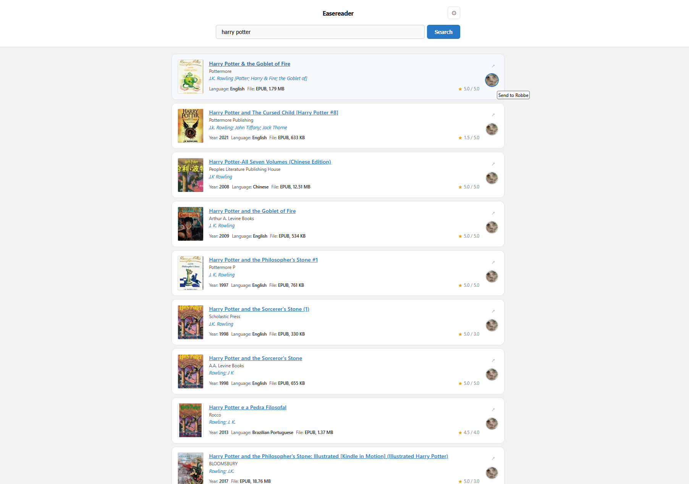
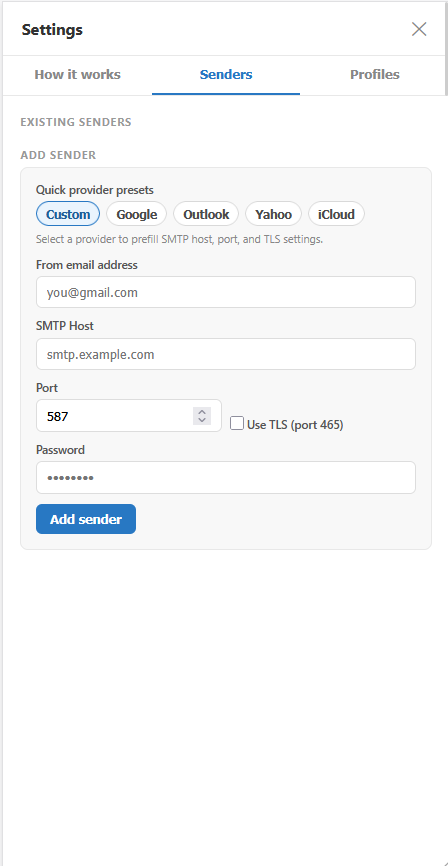
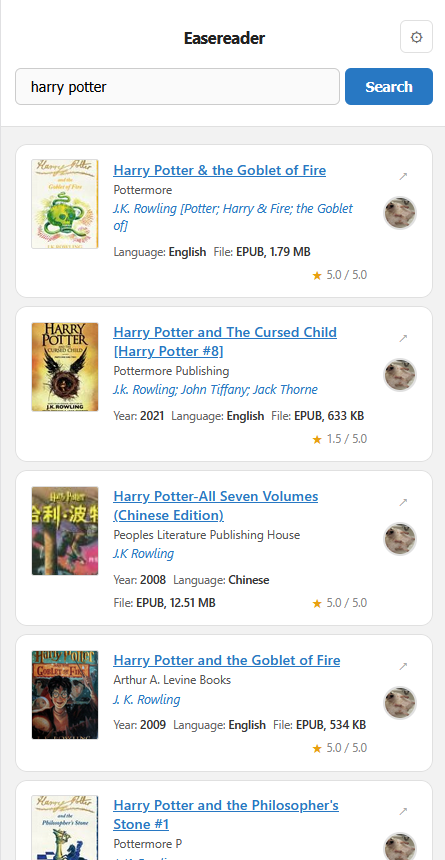

# Easereader

Simple web app to search EPUB books and send them to your ebook device via email profiles.

## Run

### npm start
1. Install dependencies:
   ```bash
   npm install
   ```
2. Start the app:
   ```bash
   npm start
   ```
3. Open: http://localhost:3000

### Docker (published image)
1. Pull image:
   ```bash
   docker pull taltiko/easereader
   ```
2. Run container:
   ```bash
   docker run --rm -p 3000:3000 -v easereader-config:/config taltiko/easereader
   ```
3. Open: http://localhost:3000

## Sender/Profile setup
1. Open Settings.
2. Add a Sender (SMTP account that sends emails).
3. Add a Profile (device email + sender to use).
4. Use profile buttons on search results to send books.

Note: your device/service may require sender whitelisting.

## Screenshots

### Desktop


### Settings


### Mobile

